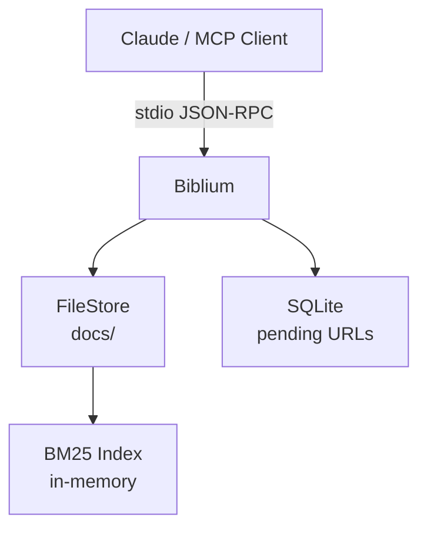
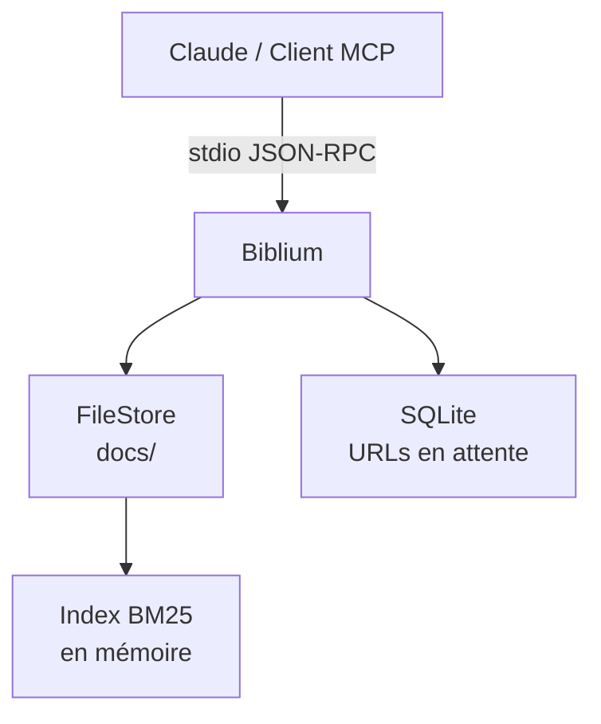

# 📚 Biblium

[](https://github.com/mipsou/mcp-biblium/stargazers)
[](https://github.com/mipsou/mcp-biblium/network)
[](https://joinup.ec.europa.eu/collection/eupl/eupl-text-eupl-12)
[](https://github.com/mipsou/mcp-biblium/actions)
[](https://go.dev/)
[](https://github.com/mipsou/mcp-biblium/commits/main)
[](https://github.com/mipsou/mcp-biblium/issues)
[](https://github.com/mipsou/mcp-biblium)
[](https://github.com/mipsou/mcp-biblium)

[](https://github.com/mipsou/mcp-biblium)
[](https://github.com/mipsou/mcp-biblium)
[](https://github.com/mipsou/mcp-biblium)
[](https://github.com/mipsou/mcp-biblium)
[](https://github.com/mipsou/mcp-biblium)
[](https://github.com/mipsou/mcp-biblium/issues/23)

**Your AI's personal library.** A knowledge base server that gives Claude (or any MCP client) the ability to store, search, and retrieve documents — organized into collections you control.

🇬🇧 [English](#-why-biblium) | 🇫🇷 [Français](#-pourquoi-biblium)

---

## 🇬🇧 Why Biblium?

LLMs are powerful but stateless. Biblium gives them **persistent, searchable memory** through the [Model Context Protocol](https://modelcontextprotocol.io/).

Drop documentation, notes, or any text into named collections. Biblium indexes everything with BM25 ranking and makes it instantly searchable by your AI assistant.

### What makes it different

- **Single binary, zero dependencies** — Pure Go, no CGO, no Python, no Docker. Just copy and run.
- **Works offline** — No cloud service, no API keys. Your data stays on your machine.
- **URL ingestion with approval** — Suggest web pages to add; they're fetched and converted to markdown only after you approve.
- **~17 MB binary, ~2600 lines of Go** — Small, auditable, maintainable.

### Quick start

```bash
# Build
go build -o biblium ./cmd/biblium

# Run (starts MCP stdio server)
BIBLIUM_DATA_DIR=./my-knowledge biblium
```

Add to **Claude Desktop** (`claude_desktop_config.json`):

```json
{
  "mcpServers": {
    "biblium": {
      "command": "/path/to/biblium",
      "env": {
        "BIBLIUM_DATA_DIR": "/path/to/data"
      }
    }
  }
}
```

Multiple instances with separate data directories:

```json
{
  "mcpServers": {
    "biblium-infra": {
      "command": "/path/to/biblium",
      "env": { "BIBLIUM_DATA_DIR": "/data/infra-docs" }
    },
    "biblium-dev": {
      "command": "/path/to/biblium",
      "env": { "BIBLIUM_DATA_DIR": "/data/dev-docs" }
    }
  }
}
```

Then ask Claude: *"Create a collection called 'golang' and add my notes about error handling."*

### MCP Tools

| Tool | What it does |
|------|-------------|
| `create_collection` | Create a new knowledge collection |
| `list_collections` | List all collections |
| `add_document` | Add a document to a collection |
| `list_documents` | List documents in a collection |
| `read_document` | Read a document's content |
| `search` | Full-text search across all collections (BM25) |
| `suggest_url` | Suggest a URL for ingestion (requires approval) |
| `approve_url` | Approve and fetch a pending URL as markdown |
| `list_pending` | List all pending URL suggestions |

### How it works



Collections live as directories on disk. Documents are plain text files. The BM25 index rebuilds from disk on startup — no separate database for search.

### Configuration

| Variable | Default | Description |
|----------|---------|-------------|
| `BIBLIUM_DATA_DIR` | `~/biblium_data` | Where collections are stored |
| `BIBLIUM_SEARCH_BACKEND` | `bm25` | Search engine (`bm25` or `ollama`) |
| `BIBLIUM_LOG_LEVEL` | `info` | Log verbosity |

### Cross-compilation

No CGO means easy cross-compilation for any platform:

```bash
GOOS=linux   GOARCH=amd64 go build -o biblium ./cmd/biblium
GOOS=linux   GOARCH=arm64 go build -o biblium ./cmd/biblium
GOOS=darwin  GOARCH=arm64 go build -o biblium ./cmd/biblium
GOOS=freebsd GOARCH=amd64 go build -o biblium ./cmd/biblium
```

### License

[EUPL-1.2-or-later](https://joinup.ec.europa.eu/collection/eupl/eupl-text-eupl-12) — Free and open source, compatible with GPL, AGPL, MPL.

---

## 🇫🇷 Pourquoi Biblium ?

Les LLMs sont puissants mais sans mémoire. Biblium leur donne une **mémoire persistante et cherchable** via le [Model Context Protocol](https://modelcontextprotocol.io/).

Déposez de la documentation, des notes ou du texte dans des collections nommées. Biblium indexe tout avec un classement BM25 et rend le contenu instantanément accessible à votre assistant IA.

### Ce qui le distingue

- **Un seul binaire, zéro dépendance** — Go pur, pas de CGO, pas de Python, pas de Docker. Copier et lancer.
- **Fonctionne hors ligne** — Aucun service cloud, aucune clé API. Vos données restent sur votre machine.
- **Ingestion d'URL avec approbation** — Proposez des pages web ; elles sont récupérées en markdown uniquement après validation.
- **~17 Mo, ~2600 lignes de Go** — Petit, auditable, maintenable.

### Démarrage rapide

```bash
# Compiler
go build -o biblium ./cmd/biblium

# Lancer (serveur MCP stdio)
BIBLIUM_DATA_DIR=./mes-connaissances biblium
```

Ajouter dans **Claude Desktop** (`claude_desktop_config.json`) :

```json
{
  "mcpServers": {
    "biblium": {
      "command": "/chemin/vers/biblium",
      "env": {
        "BIBLIUM_DATA_DIR": "/chemin/vers/data"
      }
    }
  }
}
```

Plusieurs instances avec des répertoires séparés :

```json
{
  "mcpServers": {
    "biblium-infra": {
      "command": "/chemin/vers/biblium",
      "env": { "BIBLIUM_DATA_DIR": "/data/docs-infra" }
    },
    "biblium-dev": {
      "command": "/chemin/vers/biblium",
      "env": { "BIBLIUM_DATA_DIR": "/data/docs-dev" }
    }
  }
}
```

Puis demandez à Claude : *« Crée une collection 'golang' et ajoute mes notes sur la gestion d'erreurs. »*

### Outils MCP

| Outil | Fonction |
|-------|----------|
| `create_collection` | Créer une nouvelle collection |
| `list_collections` | Lister toutes les collections |
| `add_document` | Ajouter un document à une collection |
| `list_documents` | Lister les documents d'une collection |
| `read_document` | Lire le contenu d'un document |
| `search` | Recherche plein texte sur toutes les collections (BM25) |
| `suggest_url` | Proposer une URL à ingérer (approbation requise) |
| `approve_url` | Approuver et récupérer une URL en markdown |
| `list_pending` | Lister les URLs en attente |

### Architecture



Les collections sont des répertoires sur disque. Les documents sont des fichiers texte. L'index BM25 se reconstruit au démarrage — pas de base séparée pour la recherche.

### Configuration

| Variable | Défaut | Description |
|----------|--------|-------------|
| `BIBLIUM_DATA_DIR` | `~/biblium_data` | Répertoire de stockage |
| `BIBLIUM_SEARCH_BACKEND` | `bm25` | Moteur de recherche (`bm25` ou `ollama`) |
| `BIBLIUM_LOG_LEVEL` | `info` | Niveau de log |

### Cross-compilation

Aucun CGO — compilation croisée pour toute plateforme :

```bash
GOOS=linux   GOARCH=amd64 go build -o biblium ./cmd/biblium
GOOS=linux   GOARCH=arm64 go build -o biblium ./cmd/biblium
GOOS=darwin  GOARCH=arm64 go build -o biblium ./cmd/biblium
GOOS=freebsd GOARCH=amd64 go build -o biblium ./cmd/biblium
```

### Licence

[EUPL-1.2-ou-ultérieure](https://joinup.ec.europa.eu/collection/eupl/eupl-text-eupl-12) — Libre et open source, compatible GPL, AGPL, MPL.
