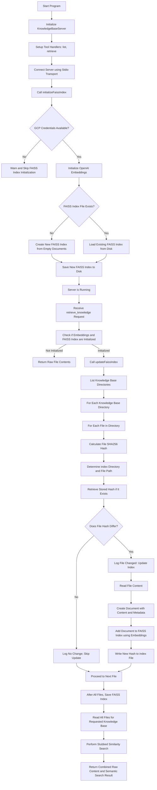

```mermaid
flowchart TD
    A[Start Program] --> B[Initialize KnowledgeBaseServer]
    B --> C[Setup Tool Handlers: list, retrieve]
    C --> D[Connect Server using Stdio Transport]
    D --> E[Call initializeFaissIndex]
    
    E --> F{GCP Credentials Available?}
    F -- No --> G[Warn and Skip FAISS Index Initialization]
    F -- Yes --> H[Initialize OpenAI Embeddings]
    H --> I{FAISS Index File Exists?}
    I -- Yes --> J[Load Existing FAISS Index from Disk]
    I -- No --> K[Create New FAISS Index from Empty Documents]
    K --> L[Save New FAISS Index to Disk]
    J --> L
    L --> M[Server is Running]
    
    M --> N[Receive retrieve_knowledge Request]
    N --> O[Check if Embeddings and FAISS Index are Initialized]
    O -- Not Initialized --> P[Return Raw File Contents]
    O -- Initialized --> Q[Call updateFaissIndex]
    
    Q --> R[List Knowledge Base Directories]
    R --> S[For Each Knowledge Base Directory]
    S --> T[For Each File in Directory]
    T --> U[Calculate File SHA256 Hash]
    U --> V[Determine index Directory and File Path]
    V --> W[Retrieve Stored Hash if It Exists]
    W --> X{Does File Hash Differ?}
    X -- No --> Y[Log No Change; Skip Update]
    X -- Yes --> Z[Log File Changed: Update Index]
    Z --> AA[Read File Content]
    AA --> AB[Create Document with Content and Metadata]
    AB --> AC[Add Document to FAISS Index using Embeddings]
    AC --> AD[Write New Hash to index File]
    Y --> AE[Proceed to Next File]
    AD --> AE
    AE --> AF[After All Files, Save FAISS Index]
    
    AF --> AG[Read All Files for Requested Knowledge Base]
    AG --> AH[Perform Stubbed Similarity Search]
    AH --> AI[Return Combined Raw Content and Semantic Search Result]

```